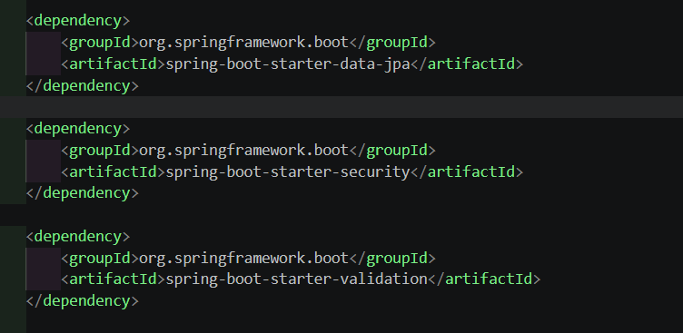
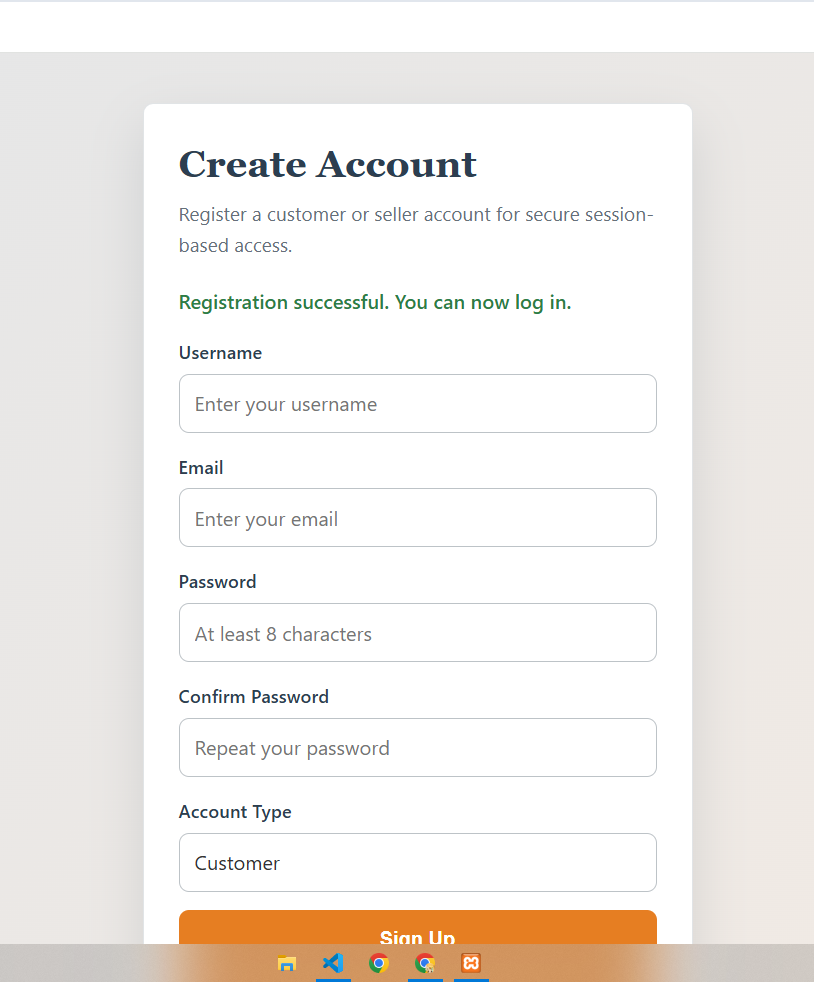
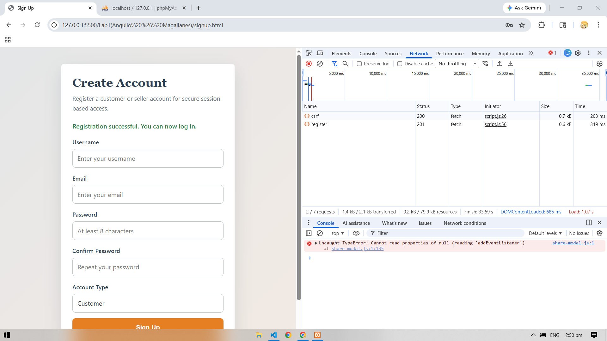
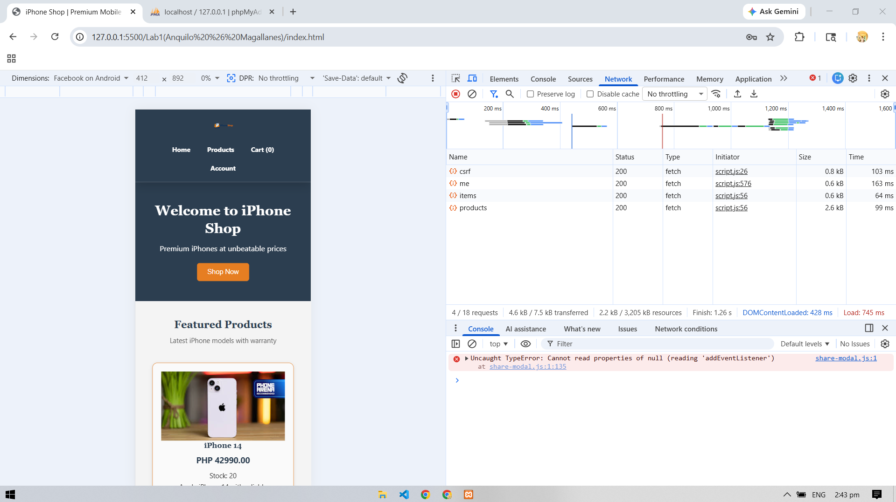
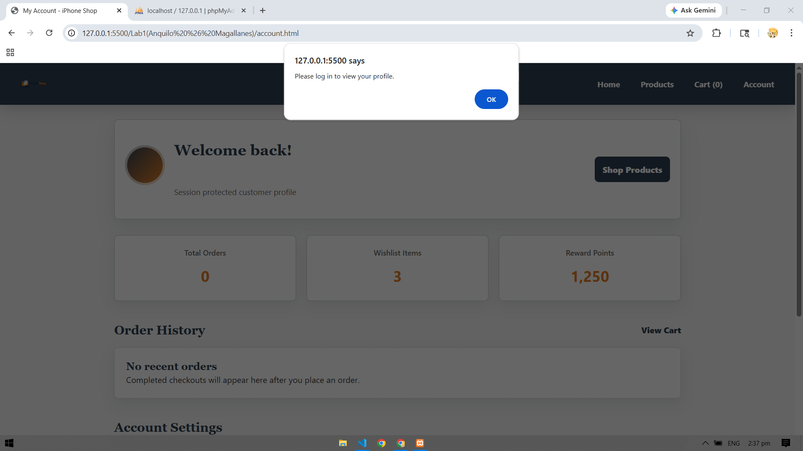
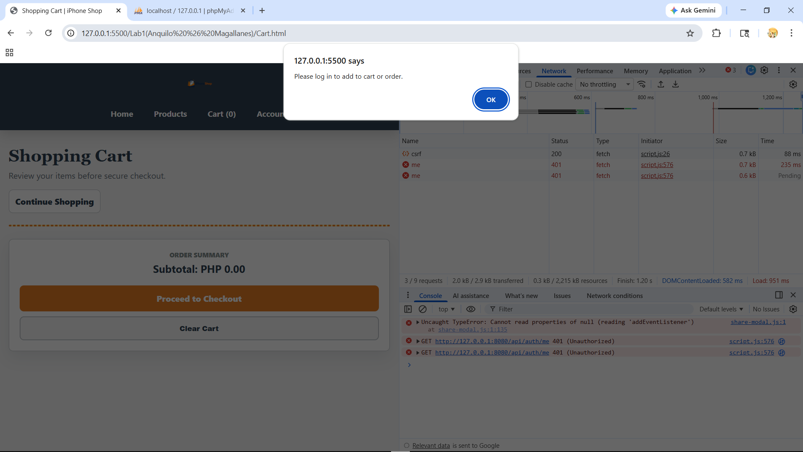
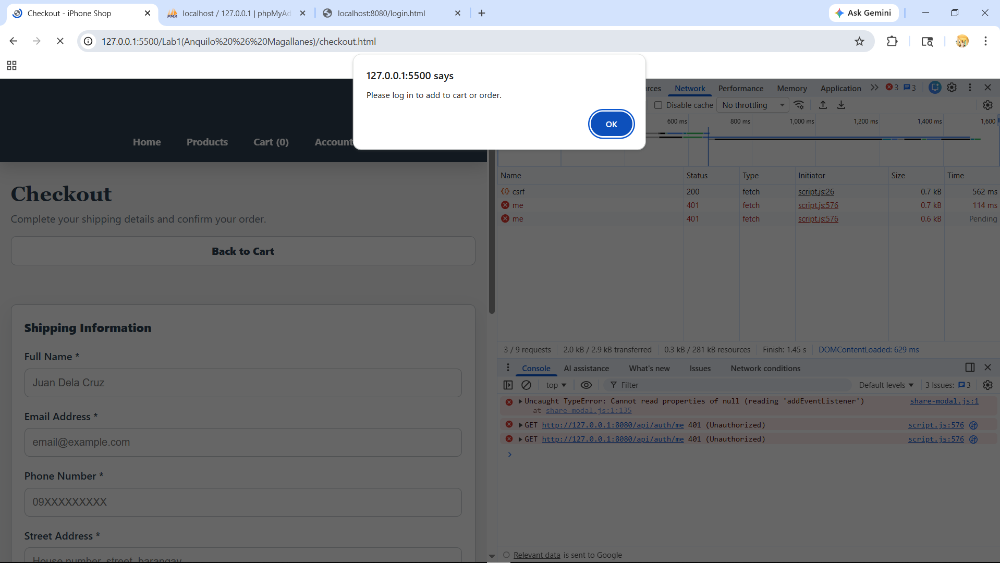
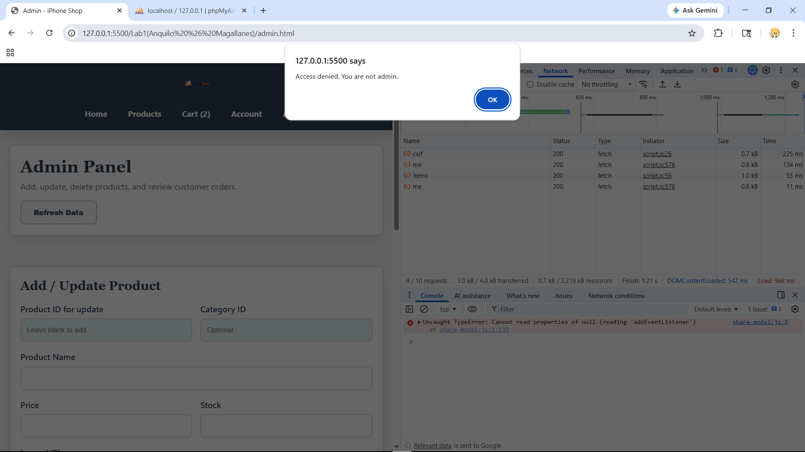
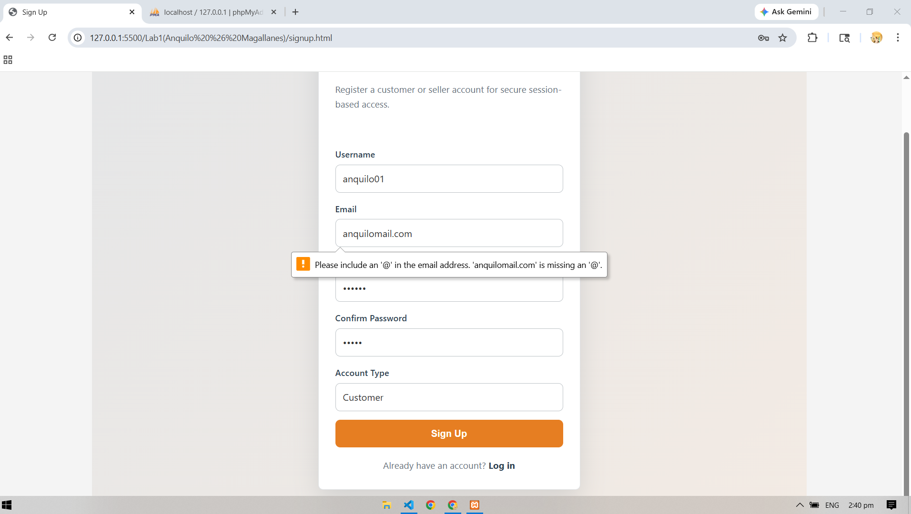

# E-Commerce Full-Stack Application - Lab 9
## Session-Based Spring Security, Bean Validation, and Fetch API

This Lab 9 documentation records the implemented Spring Security flow and uses only the screenshot files that exist in `screenshots/`. Placeholder sections without matching evidence screenshots were removed.

## Implemented Security Flow

- Public endpoints include `GET /api/auth/csrf`, `POST /api/auth/register`, `POST /login`, and `GET /api/products/**`.
- Login uses Spring Security form login at `POST /login`.
- Authenticated sessions use the server-side `JSESSIONID` cookie.
- CSRF is enabled. The frontend gets the token from `GET /api/auth/csrf` and sends it on unsafe protected requests.
- Protected endpoints include `/api/auth/me`, `/api/cart/**`, and `/api/orders/**`.
- Admin-only actions include `POST`, `PUT`, and `DELETE` requests to `/api/products/**`, plus the admin orders endpoint.
- Logout uses `POST /logout` and invalidates the active session.

## Main Endpoints

| Method | Endpoint | Access | Purpose |
|--------|----------|--------|---------|
| GET | `/api/auth/csrf` | Public | Load CSRF token |
| POST | `/api/auth/register` | Public | Create a user |
| POST | `/login` | Public | Authenticate user |
| POST | `/logout` | Authenticated | End session |
| GET | `/api/auth/me` | Authenticated | Get current user |
| GET | `/api/products/**` | Public | Browse products |
| POST | `/api/cart/**` | Authenticated | Modify cart |
| GET | `/api/cart/**` | Authenticated | View cart |
| POST | `/api/orders` | Authenticated | Place order |
| GET | `/api/orders/**` | Authenticated | View order information |
| POST/PUT/DELETE | `/api/products/**` | Admin | Manage products |

## Evidence Screenshots

### 1. Spring Security And Validation Dependencies

The backend `pom.xml` includes the Spring Security and validation dependencies required for Lab 9.

### 2. CSRF Token Request

`GET http://localhost:8080/api/auth/csrf` returns the CSRF token details used by protected unsafe requests.

### 3. Unauthorized Protected Request

A protected request without the required authenticated session or CSRF token is rejected.

### 4. Frontend Registration Success

The registration page confirms that a new user can be created from the frontend.

### 5. Registration Network Result

The browser/network evidence shows the registration request returning a successful response.

### 6. Login Success

The login page confirms that a registered user can sign in and start an authenticated session.

### 7. Protected Account/Profile Route

A protected account/profile route redirects unauthenticated users to login.

### 8. Protected Cart Page

The cart page blocks unauthenticated access before cart actions are allowed.

### 9. Protected Checkout Page

The checkout page requires an authenticated session before placing an order.

### 10. Admin Route Protection

The admin page denies access to a user without the required admin role.

### 11. Browser Validation Error

The signup page displays a validation error when invalid registration data is submitted.

